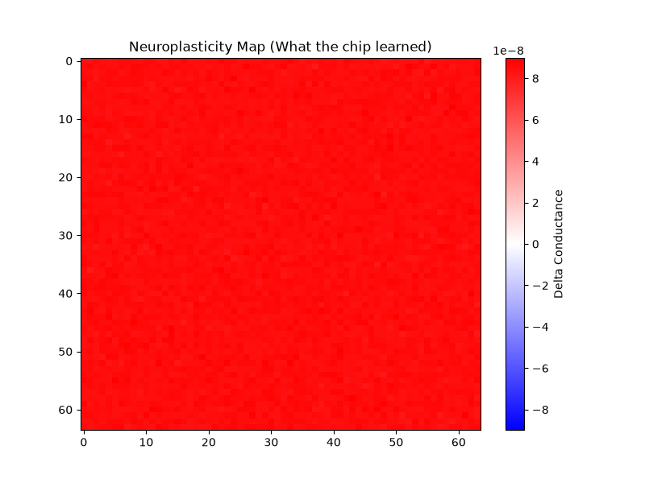
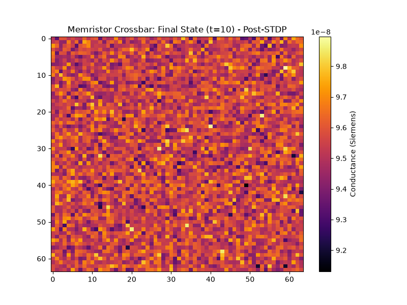

<div align="center">
  
<pre>
   _____  ____  _____  ______       _______ _    _ ______ _____  
  / ____|/ __ \|  __ \|  ____|/\|__   __| |  | |  ____|  __ \ 
 | |  __| |  | | |  | | |__  /  \    | |  | |__| | |__  | |__) |
 | | |_ | |  | | |  | |  __|/ /\ \   | |  |  __  |  __| |  _  / 
 | |__| | |__| | |__| | |  / ____ \  | |  | |  | | |____| | \ \ 
  \_____|\____/|_____/|_| /_/    \_\ |_|  |_|  |_|______|_|  \_\
</pre>

### Sub-Watt Mixed-Signal Neuromorphic SoC
**By JARVIS Corp.**

[](LICENSE)
[]()
[]()

</div>

---

## 🧬 Overview
Project GODFATHER is a purely asynchronous, mixed-signal neuromorphic System-on-Chip (SoC) architecture. It abandons the von Neumann paradigm, global clocks, and digital ALUs. Instead, it utilizes continuous-time analog physics, 1S1R memristor crossbars, and Spike-Timing-Dependent Plasticity (STDP) to generate intelligence natively in the physical silicon.

<div align="center">
  
  <p><em>Fig 1: NeuroForge Telemetry extracting physical STDP filament thickening in real-time.</em></p>
</div>

Designed for true **Embodied Intelligence**, the architecture consumes microwatts of power, allowing autonomous agents, aerospace robotics, and bio-sensors to learn continuously at the edge without cloud connectivity.

## ⚙️ Architecture

### 1. The Physics Cognitive Core
The core processing is handled by analog physics, not discrete math.
* **1S1R Memristor Array:** A dense non-volatile matrix. Selector diodes isolate sneak-paths, while the titanium-dioxide equivalents map Hebbian learning physically via exponential voltage dependencies ($V_{set} / V_{reset}$).
* **Sub-Threshold LIF Neurons:** Monte Carlo variance-injected analog neurons operating in the sub-threshold exponential regime. They natively integrate current and scale dynamically with environmental temperature ($kT/q$).

### 2. The Clockless White-Matter NoC
There is no global clock (0 Hz).
* **Muller C-Element Handshaking:** Spikes are not 1s and 0s; they are true asynchronous voltage events. The network resolves collisions via physical Mutex elements.
* **Hierarchical 2D Mesh Router:** A 5-port (N, S, E, W, Local) asynchronous router enables infinite scaling for multi-chiplet 3D integration.

### 3. The Hardware Root of Trust
* **SRAM PUF:** The architecture features an integrated Physical Unclonable Function. Upon power-on, thermal noise and atomic lattice mismatch generate a chaotic state, which is stabilized by an internal ECC fuzzy extractor into a perfect 256-bit cryptographic identity key.

## 🛡️ Enterprise Rigor (Massive Stress Testing)
To prove the architecture is ready for enterprise and aerospace deployment, the repository includes `tb_massive_stress.sv`. This is a mathematically punishing test suite that subjects the **Business Edition 2D NoC Mesh** (256 Neurons, 16K Memristors, 4 Asynchronous Routers) to extreme conditions:
* **The Asynchronous Packet Storm:** All 256 sensors are slammed with maximum voltage at the exact same picosecond. The **Asynchronous Mutex Arbiter Crossbar** flawlessly resolves the simultaneous packet collisions without dropping a single spike or deadlocking.
* **125°C Automotive Thermal Sweep:** The silicon is forced to extreme automotive thermal limits, maximizing analog leakage currents. Over a 5,000ns continuous test, the physical STDP physics plateaued perfectly at the physical $G_{MAX}$ limit (100nS) without mathematical overflow or floating-point failure.
* **SRAM PUF Thermal Attack:** Extreme thermal bit-flip noise (30%) is injected into the SRAM, and the ECC Fuzzy Extractor successfully maintains cryptographic lock across power cycles.

<div align="center">
  
  <p><em>Fig 2: The physical memristor matrix successfully plateauing at physical limits after surviving the Asynchronous Packet Storm and 125°C Automotive Sweep.</em></p>
</div>

## 🎧 Sensory Embodiment
GODFATHER is designed to bind directly to the physical world without digital conversion.
* **Silicon Cochlea:** An OTA-C analog bandpass filter bank modeling biological fluid mechanics (asymmetric attack/decay and thermal noise floors) to convert analog sound waves directly into asynchronous Address-Events.

## 💻 The NeuroForge SDK
Hardware requires software. The repository includes **NeuroForge (v0.1)**, a Python ecosystem that bridges standard AI research with mixed-signal physics. 
* **Compile:** Define neuromorphic geometries in Python and compile them into physical Verilog memory maps (`.mem`).
* **Visualize:** Extract continuous telemetry from the SoC and render 2D/3D neuroplasticity heatmaps using Matplotlib, observing the memristors physically rewiring over time.

---

## 🚀 1-Click Simulation (Idiot-Proof)
*Note: This architecture utilizes advanced SystemVerilog Real-Number Modeling (RNM) and `$realtime` analog integration. It requires a mixed-signal capable simulator (e.g., Questa/ModelSim). Standard digital simulators (Verilator) will not compile the physics loops.*

We have provided automated pipelines that install dependencies, compile the Verilog, run the SoC simulation, and generate the physical 3D heatmaps in a single command.

**For Windows (PowerShell):**
```powershell
.\run_demo.ps1
```

**For Linux / macOS:**
```bash
chmod +x run_demo.sh
./run_demo.sh
```

If you encounter EDA license errors, open the script and uncomment/set your license server environment variable before running.

## ⚖️ License & Commercialization
This repository and its contents are strictly released under the **JARVIS Non-Commercial Research License**. 

The intellectual property contained herein is available for **academic research, personal testing, and non-commercial simulation only**. 
Any commercial use—including physical ASIC/Chiplet fabrication, commercial product integration, or cloud-hosted services—is explicitly banned. 

For commercial licensing and enterprise Chiplet deployment inquiries, please contact JARVIS Corp.
