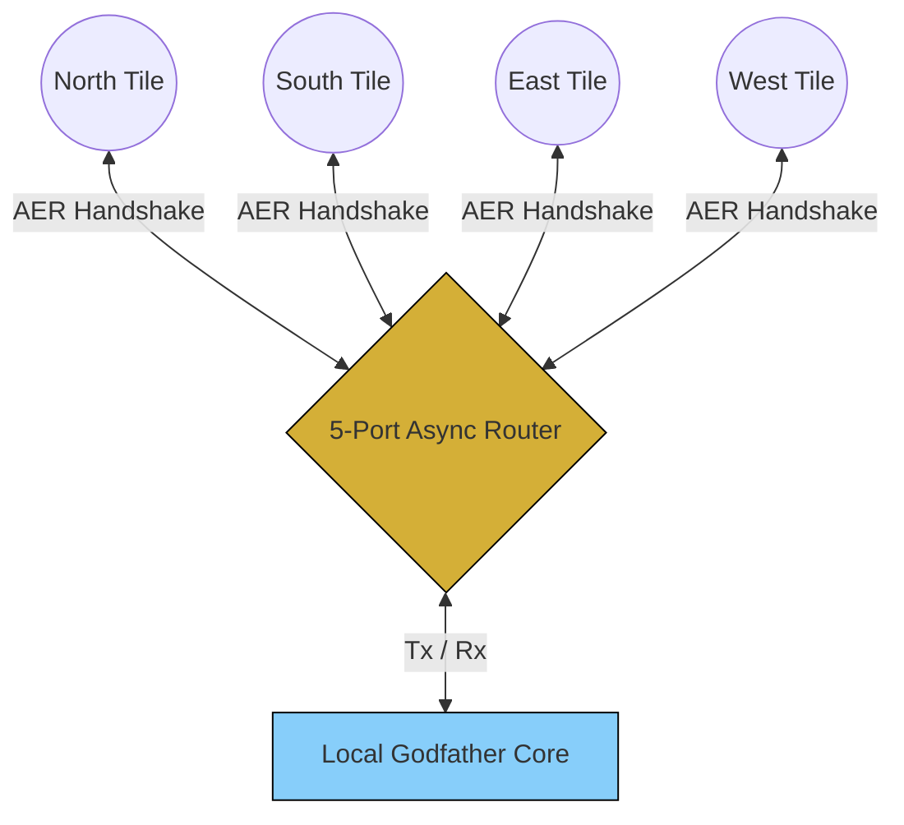

# THE GODFATHER PROJECT BIBLE
**The Master Blueprint for the World’s First Sub-Watt, Asynchronous AGI-SoC**

---

## 1. EXECUTIVE SUMMARY
For the past 15 years, the artificial intelligence industry has been trapped in the von Neumann bottleneck. The world builds "Brains in Vats"—disembodied, clock-driven, multi-megawatt Language Models dependent on massive data centers.

**Project GODFATHER** is the physical rebellion. It is a mixed-signal, completely clockless, memristor-based System-on-Chip (SoC) designed for **Embodied Intelligence**. It does not calculate intelligence using discrete software; it generates intelligence natively through the laws of analog physics. 

GODFATHER is designed to operate on microwatts of power, learning continuously in real-time via physical Spike-Timing-Dependent Plasticity (STDP), making it the only viable architecture for autonomous micro-drones, wearable medical IoT, and untethered humanoid robotics.

---

## 2. THE HARDWARE ARCHITECTURE (The Silicon Brain)
The GODFATHER architecture eliminates the ALUs, global clocks, and RAM. It is comprised of three natively integrated layers:

### A. The Sensory Binding Layer
Biological intelligence is derived from physical survival. GODFATHER features direct, analog integration with the physical world.
*   **The Silicon Cochlea (`silicon_cochlea.sv`):** An analog OTA-C bandpass filter bank modeling the fluid dynamics of the human basilar membrane. It listens to raw analog audio, applying asymmetric damping and injecting Gaussian thermal noise floors, converting resonance directly into asynchronous spikes.

### B. The Physics Layer (1S1R Cognitive Matrix)
The memory *is* the compute.
*   **Subthreshold LIF Neurons (`subthreshold_lif.sv`):** Operating in the sub-threshold exponential region, these analog neurons natively integrate current. They are mathematically cured against manufacturing mismatch via Monte Carlo (`$dist_normal`) initialization and feature dynamic scaling based on physical temperature ($kT/q$).
*   **The Memristor Crossbar (`memristor_crossbar.sv`):** A dense matrix of 1S1R (One-Selector, One-Resistor) non-volatile memristors. The selector diodes choke parasitic sneak-paths. As spikes pass through, the matrix natively calculates Ohm's and Kirchhoff's laws at the speed of light.

### C. The Clockless Digital Layer (White Matter NoC)
There is no global clock. There are no cycles. 
*   **Muller C-Element Handshakes:** When a neuron fires, it asserts a request and holds the physical voltage high until acknowledged. This naturally stretches the analog spike to biological widths, providing a massive time-window for physical STDP learning.
*   **The 2D Mesh NoC (`async_noc_router.sv`):** To scale to millions of neurons, GODFATHER abandons flat routing. It utilizes a 5-Port Asynchronous Network-on-Chip (North, South, East, West, Local) using Dimension-Order Routing to pass Address-Event Representation (AER) packets instantaneously across the silicon without metastability.

---

## 3. THE HARDWARE ROOT OF TRUST (Security)
An autonomous AGI cannot be hackable. 
*   **The SRAM PUF (`sram_puf.sv`):** The instant the chip receives power, atomic-level lattice mismatches in the SRAM cells generate a chaotic boot state.
*   **Fuzzy Extractor / ECC:** The raw output contains 10% thermal noise. A dedicated Error Correction Code (ECC) block purifies the noise, resulting in a mathematically perfect, cryptographically secure 256-bit Identity Key. It is physically unclonable and acts as the ultimate "Creator's Lock."

---

## 4. THE SOFTWARE ECOSYSTEM (NeuroForge)
Hardware is useless without a developer ecosystem. We do not force developers to write SystemVerilog; we provide **NeuroForge**.
*   **The Python Compiler:** Allows researchers to define crossbar geometries in standard Python. It simulates physical variance and compiles the weights directly into a format the silicon understands on boot (`crossbar_init.mem`).
*   **The Telemetry Visualizer:** Extracts real-time analog conductance values from the chip and renders Matplotlib 3D heatmaps. It allows data scientists to literally "watch" the silicon rewire itself.

---

## 5. THE BUSINESS STRATEGY & ECONOMICS
The GODFATHER architecture is designed to capture the Edge-AI market.

### Phase 1: The DevKit (The Trojan Horse)
Release the **Godfather Nano**—a $50 USB stick containing a TinyTapeout-fabricated core and the NeuroForge SDK. It becomes the global university standard for teaching Neuromorphic engineering, replacing Nvidia Jetson for students.

### Phase 2: UCIe Chiplet Licensing (The ARM Model)
We do not build massive, expensive wafers. We license the `godfather_business_edition.sv` IP. Because it is modularized into independent "Tiles", drone manufacturers and robotics companies can purchase a 2x2 grid or a 256x256 grid, 3D-stacking our analog brain chiplets onto their standard TSMC logic dies using the Universal Chiplet Interconnect Express (UCIe) standard.

### Phase 3: The "Reflex Marketplace"
Because the chip learns physical reflexes via STDP, those learned weights can be extracted. We will host the "NeuroForge App Store," where robotics companies can buy and sell pre-trained physical reflexes (e.g., "Egg-Crushing Avoidance", "Drone Hurricane Stabilization"). We take a 30% royalty on every reflex transaction globally.

---
*Generated by the Architect. The Blueprint is complete.*
