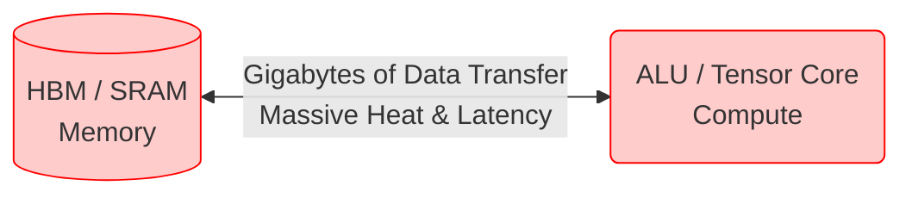
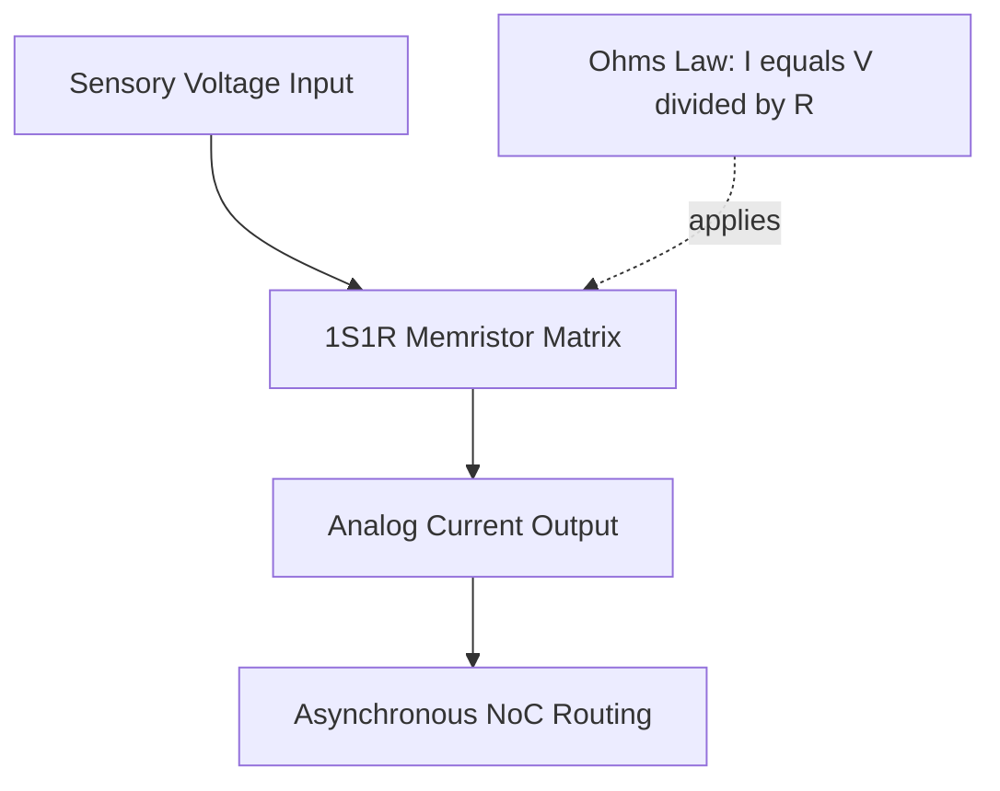

# THE PARADIGM SHIFT: Why the Current AI Era is Already Obsolete
*A Technical Comparison: Conventional AI Accelerators vs. Project GODFATHER*

The modern Artificial Intelligence boom is an illusion built on brute force. Companies are spending billions of dollars and consuming gigawatts of electricity to construct massive, water-cooled data centers. 

They are trying to build biological intelligence using calculators. 

Project GODFATHER was created because **the von Neumann architecture has failed**. To achieve true Artificial General Intelligence (AGI)—intelligence that can survive, adapt, and operate inside physical robots at the edge—we must abandon the current paradigm.

Here is the definitive technical breakdown of why current market leaders (GPUs/TPUs) are fundamentally flawed, and why the GODFATHER Mixed-Signal architecture is an irreplaceable, generational leap.

---

## 1. The Compute Paradigm: Math vs. Physics

### ❌ Conventional AI (Nvidia H100, Google TPU)
*   **The Von Neumann Bottleneck:** Current accelerators separate memory (HBM/SRAM) from compute (ALUs/Tensor Cores). To perform a single neural network calculation, the chip must fetch a weight from memory, move it across a bus, multiply it in an ALU, and write it back. 

*   **The Cost:** Over 90% of the energy in a GPU is wasted entirely on moving data back and forth, not on actually computing. This is why GPUs draw 700+ Watts and require liquid cooling.

### ⚡ Project GODFATHER
*   **In-Memory Analog Compute:** In GODFATHER, the memory *is* the compute. We utilize a dense 1S1R (One-Selector One-Resistor) Memristor Crossbar. 

*   **The Physics Advantage:** The chip calculates matrix multiplications instantly, at the speed of light, using physical **Ohm's Law ($I = V/R$)** and **Kirchhoff's Current Law**. There are no ALUs. Data never moves. 
*   **The Result:** Power consumption drops from hundreds of Watts to **Microwatts**.

---

## 2. Time Processing: Clocks vs. Asynchronous Spikes

### ❌ Conventional AI
*   **Synchronous Clock Trees:** Modern chips operate on a global clock (e.g., 2.5 GHz). Every transistor must march in lockstep. Up to 30% of a modern chip's power is wasted simply distributing this clock signal, even when the chip is doing nothing.
*   **Frame-Based Vision:** Cameras capture 60 frames per second. Even if nothing in the room moves, the GPU must process all 2 million pixels 60 times every second.

### ⚡ Project GODFATHER
*   **Clockless (0 Hz):** GODFATHER possesses absolutely no global clock. It is a purely asynchronous architecture.
*   **Event-Driven (AER):** Spikes are generated only when information changes. If a robot is looking at a static wall, the chip consumes zero active power. When an event occurs, it propagates via a **Muller C-Element Network-on-Chip (NoC)**.
*   **The Result:** Zero idle power drain. Latency drops from milliseconds (frame processing) to nanoseconds (continuous time).

---

## 3. Learning: Backpropagation vs. Physical Neuroplasticity

### ❌ Conventional AI
*   **Backpropagation:** Requires massive datasets, rigid epochs, and immense floating-point math to calculate gradient descent. 
*   **The Flaw:** A robot using a GPU cannot learn "on the fly." If it encounters a new environment, its weights are frozen. To learn, data must be sent back to a cloud server, retrained on 10,000 GPUs, and pushed back via an update.

### ⚡ Project GODFATHER
*   **Spike-Timing-Dependent Plasticity (STDP):** GODFATHER learns continuously on the edge without ever connecting to a cloud.
*   **Physical Rewiring:** When a pre-synaptic and post-synaptic spike overlap, the local voltage physically heats the titanium-dioxide filament in the memristor, altering its conductance. The chip literally, physically rewires itself in response to stimuli, identical to human neuroplasticity.
*   **The Result:** A drone or humanoid robot can adapt to a broken wing or a severed hydraulic line in real-time, learning a new physical reflex in seconds.

---

## 4. Sensory Integration: Digital vs. Analog Embodiment

### ❌ Conventional AI
*   **Digital Translation:** To hear sound, current systems require a microphone, an Analog-to-Digital Converter (ADC), digital signal processing (DSP), and CPU overhead before the AI ever sees the data as a floating-point array. This introduces massive latency and power overhead.

### ⚡ Project GODFATHER
*   **Analog Embodiment:** GODFATHER integrates a **Silicon Cochlea**—an analog OTA-C filter bank. It listens to raw analog sound waves, applying biological fluid damping, and translates acoustic resonance directly into asynchronous spikes that feed straight into the Cognitive Matrix. 
*   **The Result:** Seamless, zero-latency physical embodiment.

---

## Conclusion: The Irreplaceable Moat
The current tech giants are trapped by their own legacy software stacks. They cannot switch to analog, clockless architectures without rendering their entire Trillion-dollar CUDA/TensorFlow software empires obsolete. 

Project GODFATHER bypasses them completely. By supplying both the **Hardware Chiplet IPs** and the **NeuroForge Python SDK**, we are establishing a new foundation for AI. We are not building a slightly faster GPU. We are building the first true synthetic brain.
