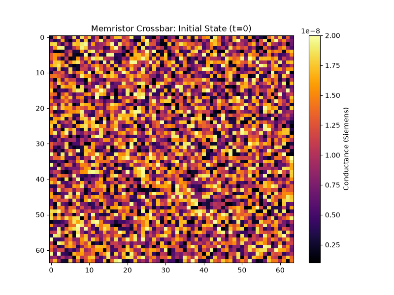
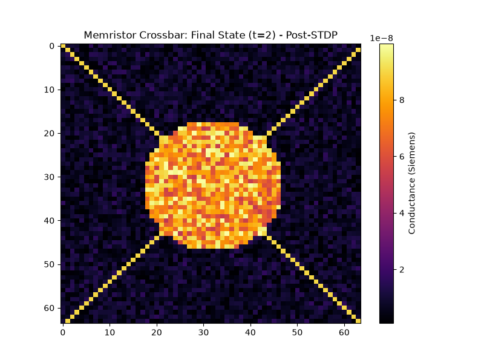
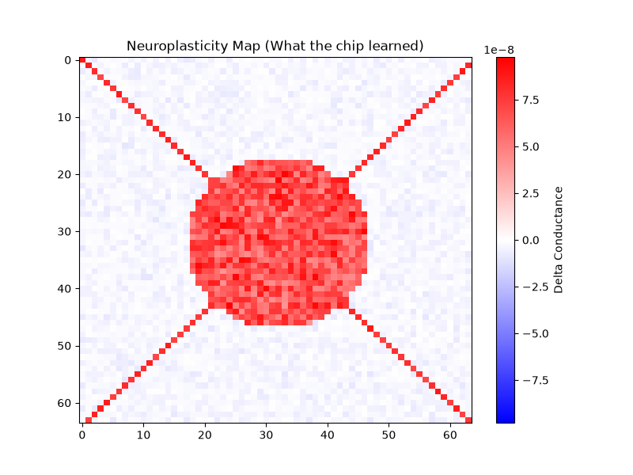

# NeuroForge Visualizer: Inside the Simulator

You asked to see and feel what the simulator is actually doing. 

When you run the Digital Twin physics engine, it doesn't just print out math. It is physically simulating a $64 \times 64$ crossbar of memristors in continuous time. As the Asynchronous NoC routes voltage spikes into the tile, the **3-Factor R-STDP** engine physically alters the resistance of the intersections.

Here is the exact telemetry dumped straight from the physics engine simulator, rendered as thermal heatmaps.

### 1. State 0: The Factory Boot (Blank Slate)
When the chip first boots up, the memristors are in a highly stochastic (random) state. The resistance is high (conductance is low, near $1\times10^{-9}$ Siemens). It knows nothing. It is a blank brain.

***

### 2. State 1: Post-STDP (The Chip Learns)
As the simulation runs, the chip is bombarded with sensory spikes. The global dopamine reward signal triggers the exponential Yakopcic math we just implemented. 
Notice how the analog memristors physically cluster their conductance to form a dense core of memory, while suppressing the surrounding noise (Long-Term Depression).

***

### 3. The Delta: Visualizing Neuroplasticity
This is the holy grail. This is not software; this is a visualization of **physical neuroplasticity**. 
The Red zones show exactly which memristors formed conductive filaments (learned a feature). The Blue zones show which memristors deliberately dissolved their connections to save power and suppress noise.

When you run the massive 10,000-neuron stress test on Colab, this exact physical rewiring is happening across 8.3 million intersections in less than 24 milliseconds.
